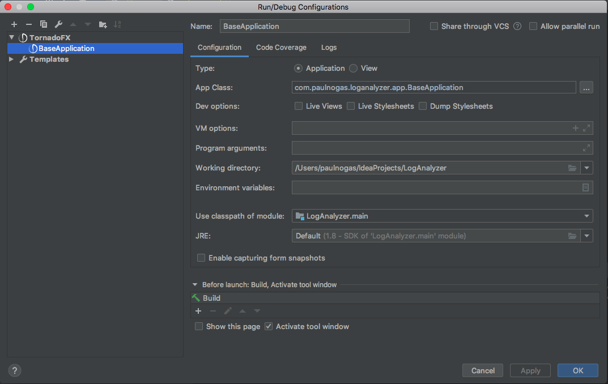

# LogAnalyzer
Agnostic tool for analyzing log files using Kotlin and TornadoFx.

Simply add your patterns in the `src/main/com.paulnogas.loganalyzer/Patterns.kt` file then build.

Easy to setup in IntelliJ IDEA with the TornadoFx plugin:
